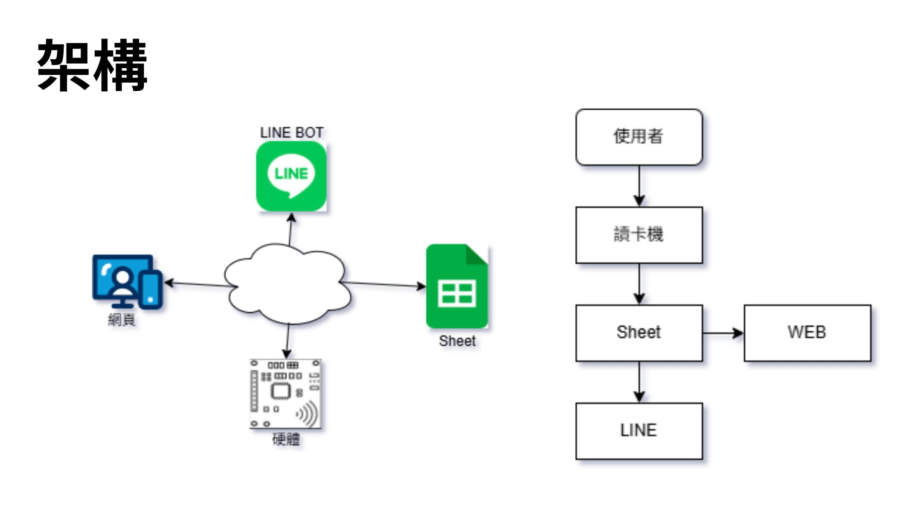
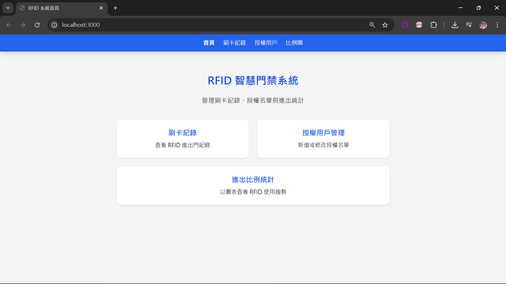
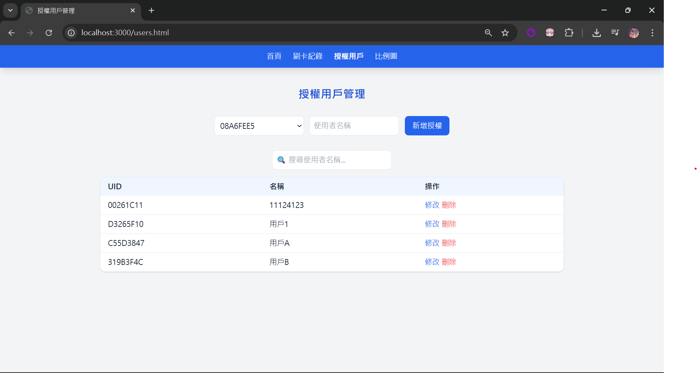
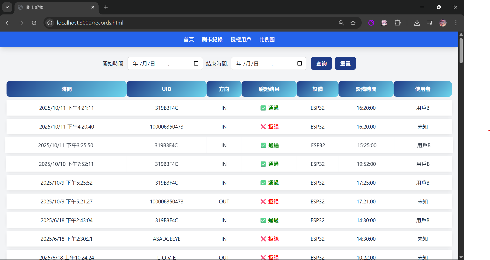
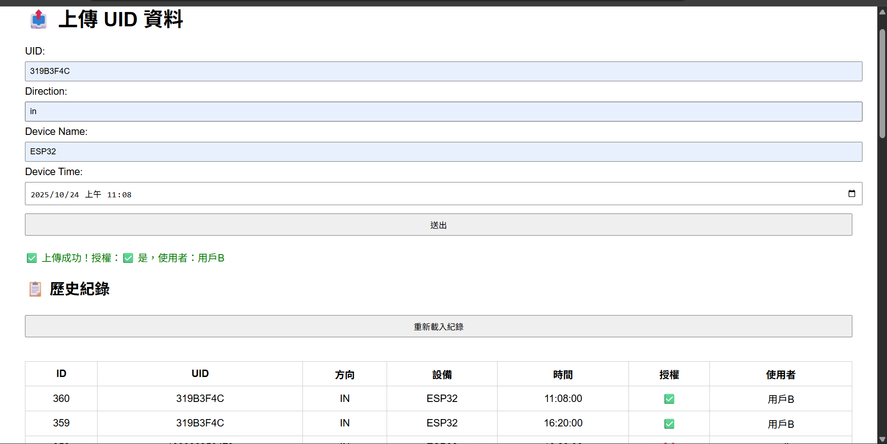
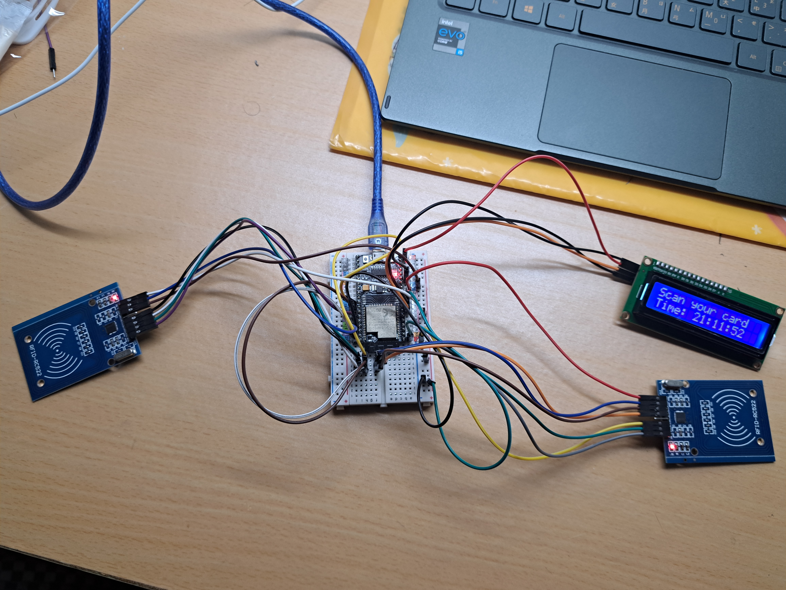
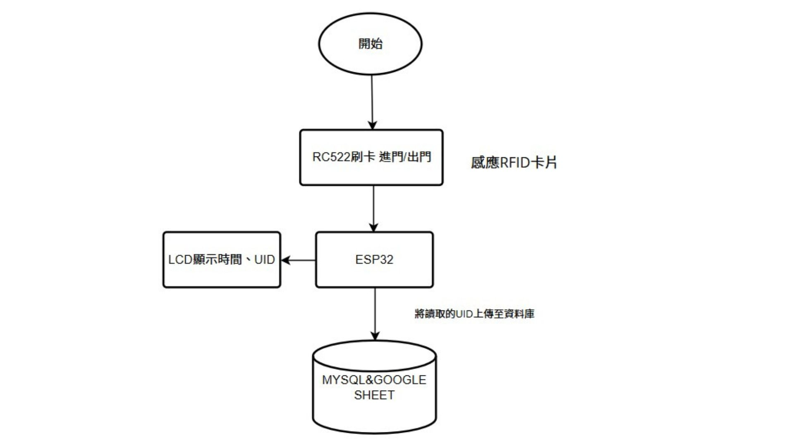
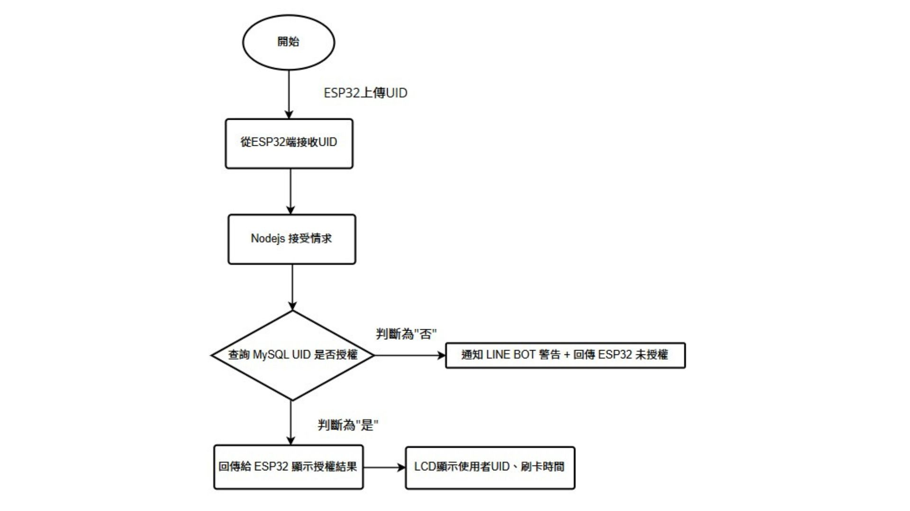
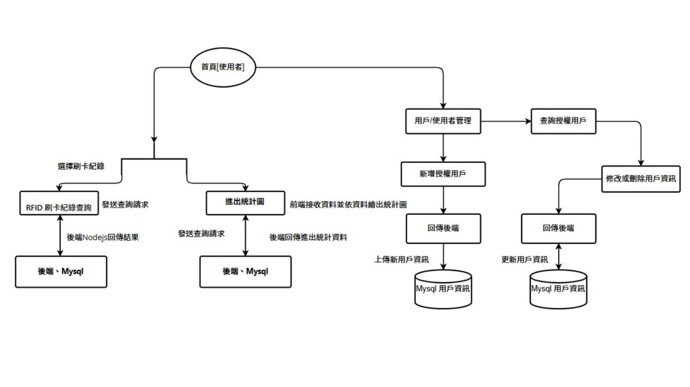

# 智慧門禁系統 — 智慧照護物聯網課程專題

## 專案簡介
本專題為「智慧照護物聯網」課程專案，利用 **ESP32** 搭配 **Arduino IDE** 開發智慧門禁系統。  
系統透過授權卡片進行身分驗證，並即時將刷卡紀錄上傳至資料庫。  
網頁端提供可視化介面，授權用戶可即時查看進出狀態；若偵測到未授權用戶，系統會透過 **LINE BOT** 即時發送警示通知，以達到即時防護效果。

---

## 使用技術
- **硬體開發板**：ESP32  
- **開發環境**：Arduino IDE  
- **後端技術**：Node.js  
- **通知機制**：LINE BOT  
- **測試工具**：Rust  

---

## 主要功能
- **RFID 身分驗證**：授權卡片通過驗證後方可進入。  
- **資料即時上傳**：ESP32 自動上傳刷卡紀錄至資料庫。  
- **網頁介面顯示**：提供用戶管理與即時狀態可視化。  
- **異常通知機制**：未授權進入時即時發送 LINE 警示。  
- **系統測試驗證**：使用 Rust 模擬資料傳輸，驗證後端穩定性與正確性。  

---

## 系統架構
  
**說明**：系統由 ESP32 負責資料擷取與上傳，Node.js 處理後端邏輯並連接資料庫，同時透過 LINE BOT 推播通知。

---

## 網頁介面

### 首頁
  
**說明**：首頁顯示系統狀態與即時進出紀錄，提供使用者快速了解當前門禁狀況。

### 用戶管理
  
**說明**：可在此新增、修改或刪除授權卡片資訊，進行用戶身分管理。

### 刷卡紀錄
  
**說明**：顯示所有授權與未授權的刷卡紀錄，便於後續查詢與追蹤。

---

## LINE BOT 實作
  
**說明**：LINE BOT 負責即時通知與互動，當偵測到異常刷卡或未授權進入時會自動推播訊息給管理員。

---

## 模擬資料傳輸
  
**說明**：以 Rust 撰寫模擬程式，模擬 ESP32 的資料傳輸行為，用以測試伺服器端接收與處理的正確性。

---

## 實體裝置
  
**說明**：智慧門禁實體裝置，包含 ESP32 模組、RFID 感應器與授權卡片。

### 刷卡機流程
  
**說明**：展示刷卡機的運作流程，從感應授權卡到伺服器回傳驗證結果的完整過程。

---

## LINE BOT 判斷
  
**說明**：顯示 LINE BOT 判斷邏輯，當系統收到未授權使用者嘗試進入時，觸發警示通知機制。

---

## Web 流程
  
**說明**：展示整體 Web 系統流程，包含使用者操作、資料傳遞與即時更新的處理架構。
